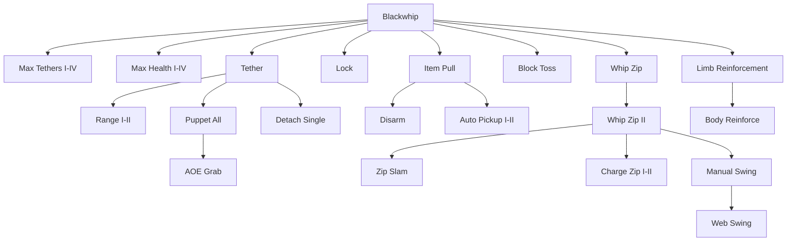

import QuirkIcon from '@site/src/components/QuirkIcon';

# Blackwhip Upgrade Tree

Buy nodes in the in-game power tree with **upgrade points**. Points are earned by spending [stamina under pressure](../../../core-systems/stamina/stamina-progression-and-training.md).

:::tip Free with the quirk
**Tether**, **Detach (All)**, **Puppet (Single)**, and **Whip Zip** start unlocked. You still buy the rest of each branch.
:::

A fully bought tree costs **105 upgrade points**.

## Branch Summary

| Branch | What it buys | Points |
|--------|----------------|--------|
| [Max Tethers](#max-tethers) | Cap 2 → 3 → 4 → 5 (QF can go beyond 5) | 14 |
| [Max Health](#max-health) | Tether HP 5 → 10 → 15 → 20 hearts | 26 |
| [Grab](#grab) | Range, Lock, Puppet All, AOE Grab, Detach Single | 18 |
| [Items](#items) | Item Pull, Disarm, Auto Pickup, Block Toss | 12 |
| [Movement](#movement) | Zip II, Slam, Charge Zip, Swing, Web Swing | 20 |
| [Reinforce](#reinforce) | Limb wraps + Body Reinforce | 15 |
| **Total** | | **105** |

## Max Tethers

Right branch from the center node. Each rank raises your grab cap. Effective max is `upgrade cap + (QF × 2)`.

| | Upgrade | Cost | Requires | Effect |
|---|---------|------|----------|--------|
| <QuirkIcon src="/img/quirks/blackwhip/max_tethers_1.png" /> | **Max Tethers - I** | 2 | Blackwhip | Max tethers = **2**. *You can cast out and control an additional tether.* |
| <QuirkIcon src="/img/quirks/blackwhip/max_tethers_2.png" /> | **Max Tethers - II** | 3 | Max Tethers I | Max tethers = **3** |
| <QuirkIcon src="/img/quirks/blackwhip/max_tethers_3.png" /> | **Max Tethers - III** | 4 | Max Tethers II | Max tethers = **4** |
| <QuirkIcon src="/img/quirks/blackwhip/max_tethers_4.png" /> | **Max Tethers - IV** | 5 | Max Tethers III | Max tethers = **5**. Increase Quirk Factor for more beyond 5. |

## Max Health

Left branch. How much damage a tether can take before snapping. Default without upgrades is **1 heart**.

| | Upgrade | Cost | Requires | Effect |
|---|---------|------|----------|--------|
| <QuirkIcon src="/img/quirks/blackwhip/whip_health_1.png" /> | **Max Health - I** | 2 | Blackwhip | Tether health = **5 hearts** |
| <QuirkIcon src="/img/quirks/blackwhip/whip_health_2.png" /> | **Max Health - II** | 4 | Max Health I | Tether health = **10 hearts** |
| <QuirkIcon src="/img/quirks/blackwhip/whip_health_3.png" /> | **Max Health - III** | 8 | Max Health II | Tether health = **15 hearts** |
| <QuirkIcon src="/img/quirks/blackwhip/whip_health_4.png" /> | **Max Health - IV** | 12 | Max Health III | Tether health = **20 hearts**. Upgrade QF for more. |

## Grab

Tether itself is free. Range, multi-target control, and single detach are purchased.

| | Upgrade | Cost | Requires | Effect |
|---|---------|------|----------|--------|
| <QuirkIcon src="/img/quirks/blackwhip/tether.png" /> | **Tether** | Free | Blackwhip | Unlocks [Tether](./abilities.mdx#tether). *Shoot an energy tendril towards any opponent or entity. If they are hit, they become ensnared in your whip, allowing you to perform multiple actions.* |
| <QuirkIcon src="/img/quirks/blackwhip/tether_range_1.png" /> | **Tether Range - I** | 3 | Tether | Grab range base **12** (+3 blocks). Formula: `12 + QF × 3` |
| <QuirkIcon src="/img/quirks/blackwhip/tether_range_2.png" /> | **Tether Range - II** | 4 | Range I | Grab range base **15** (+3 more). Formula: `15 + QF × 3` |
| <QuirkIcon src="/img/quirks/blackwhip/lock.png" /> | **Lock** | 2 | Blackwhip | Unlocks [Lock](./abilities.mdx#lock) on Slot 5 |
| <QuirkIcon src="/img/quirks/blackwhip/multi_puppet.png" /> | **Puppet (All)** | 3 | Puppet (Single) | Unlocks [Puppet (All)](./abilities.mdx#puppet-all) |
| <QuirkIcon src="/img/quirks/blackwhip/aoe_tether.png" /> | **AOE Grab** | 4 | Puppet (All) | Crouch + Tether grabs every nearby entity up to your max tethers. Tips still have to connect — fast targets can dodge. |
| <QuirkIcon src="/img/quirks/blackwhip/detach_all.png" /> | **Detach (All)** | Free | — | Unlocks [Detach (All)](./abilities.mdx#detach-all) |
| <QuirkIcon src="/img/quirks/blackwhip/detach_single.png" /> | **Detach (Single)** | 2 | Detach (All) | Unlocks [Detach (Single)](./abilities.mdx#detach-single) |

## Items

| | Upgrade | Cost | Requires | Effect |
|---|---------|------|----------|--------|
| <QuirkIcon src="/img/quirks/blackwhip/item_pull.png" /> | **Item Pull** | 1 | Blackwhip | Tether tips can snatch dropped items into your inventory |
| <QuirkIcon src="/img/quirks/blackwhip/disarm.png" /> | **Disarm** | 2 | Item Pull | Unlocks [Disarm](./abilities.mdx#disarm) |
| <QuirkIcon src="/img/quirks/blackwhip/magnet_1.png" /> | **Auto Pickup - I** | 2 | Item Pull | Unlocks [Auto Pickup](./abilities.mdx#auto-pickup) at **3** blocks + QF |
| <QuirkIcon src="/img/quirks/blackwhip/magnet_2.png" /> | **Auto Pickup - II** | 4 | Auto Pickup I | Extends Auto Pickup to **6** blocks + QF |
| <QuirkIcon src="/img/quirks/blackwhip/block_toss.png" /> | **Block Toss** | 3 | Blackwhip | Unlocks [Block Toss](./abilities.mdx#block-toss) |

## Movement

Whip Zip I is free. Zip II is the gate for slam, charge, and swinging.

| | Upgrade | Cost | Requires | Effect |
|---|---------|------|----------|--------|
| <QuirkIcon src="/img/quirks/blackwhip/whip_zip.png" /> | **Whip Zip** | Free | — | Unlocks [Whip Zip](./abilities.mdx#whip-zip). Range `10 + QF × 2`, pull **1.2**. *Use your whips to pull you in the direction you are looking.* |
| <QuirkIcon src="/img/quirks/blackwhip/whip_zip_2.png" /> | **Whip Zip - II** | 4 | Whip Zip | Range `20 + QF × 3`, pull **2.0**. Further extends range and speed. |
| <QuirkIcon src="/img/quirks/blackwhip/zip_slam.png" /> | **Zip Slam** | 4 | Whip Zip II | Entity zips deal `8 + QF × 2` slam damage, scaled by distance. *When tethering into entities, you fly towards and do a slam kick on them.* |
| <QuirkIcon src="/img/quirks/blackwhip/charge_zip.png" /> | **Charge Zip** | 2 | Whip Zip II | Unlocks [Charge Zip](./abilities.mdx#charge-zip). Max launch `4.0 + QF × 0.12`, damage **5** |
| <QuirkIcon src="/img/quirks/blackwhip/charge_zip_2.png" /> | **Charge Zip - II** | 5 | Charge Zip | Max launch `5.0 + QF × 0.12`, damage `8 + QF`. Extends the charge for further distance and more damage. |
| <QuirkIcon src="/img/quirks/blackwhip/whip_swing.png" /> | **Manual Swing** | 2 | Whip Zip II | Unlocks [Manual Swing](./abilities.mdx#manual-swing) |
| <QuirkIcon src="/img/quirks/blackwhip/web_swing.png" /> | **Web Swing** | 3 | Manual Swing | Unlocks [Web Swing](./abilities.mdx#web-swing) |

## Reinforce

Limb Reinforcement is a **passive** tree node. It does not take a bar slot. Body Reinforce is the Slot 5 toggle.

| | Upgrade | Cost | Requires | Effect |
|---|---------|------|----------|--------|
| <QuirkIcon src="/img/quirks/blackwhip/limb_reinforce.png" /> | **Limb Reinforcement** | 5 | — | Your Blackwhip autonomously wraps harmed limbs and reduces further damage to them. |
| <QuirkIcon src="/img/quirks/blackwhip/body_reinforce.png" /> | **Body Reinforce** | 10 | Limb Reinforcement | Unlocks [Body Reinforce](./abilities.mdx#body-reinforce) |

### Limb Reinforcement

When a limb (or its hand / foot) drops to **50% health or below**, Blackwhip wraps it and **halves** further body damage to those parts.

| Wrap | Parts protected |
|------|-----------------|
| Left arm | Left arm, left hand |
| Right arm | Right arm, right hand |
| Left leg | Left leg, left foot |
| Right leg | Right leg, right foot |

Wraps are automatic. You do not bind them on the ability bar.
